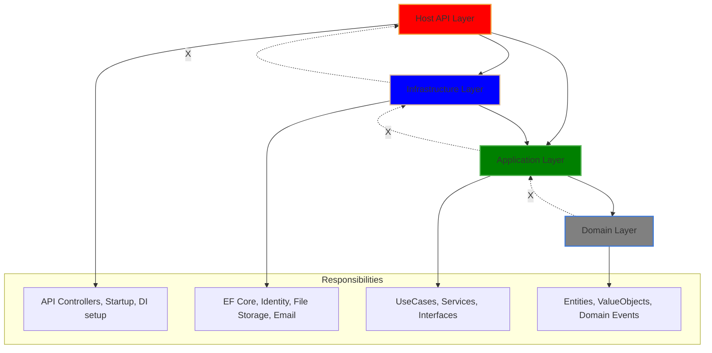

## 🧱 لایه‌ها در معماری تمیز (Clean Architecture)


``` 
[Domain]         <== هسته‌ی خالص، بدون وابستگی به هیچ‌چیز
[Application]    <== قوانین کسب‌و‌کار + واسط‌ها
[Infrastructure] <== پیاده‌سازی جزئیات (پایگاه داده، فایل، http و ...)
[Host]           <== نقطه‌ی ورودی برنامه، مثل API یا UI
```

---

### ✅ ارتباط درست بین لایه‌ها:

| لایه | می‌تونه به | نمی‌تونه به |
|------|------------|--------------|
| **Domain** | — | ❌ Application, Infrastructure, Host |
| **Application** | Domain | ❌ Infrastructure, Host |
| **Infrastructure** | Application, Domain | ❌ Host |
| **Host (API)** | Application, Infrastructure | ❌ نباید به Domain یا Application وابستگی مستقیم بزنه (بدون واسطه) |

---

### 💡 پس به طور ساده:
- `Domain`: مغز سیستم ـ قوانین مدل‌محور ـ کاملاً مستقل
- `Application`: هماهنگ‌کننده قوانین کسب‌و‌کار. فقط با interface کار می‌کنه
- `Infrastructure`: پیاده‌سازی interfaceهایی که توی Application تعریف شدن
- `Host`: API هست که پروژه رو اجرا می‌کنه، با Application کار می‌کنه، از DI همه چیزو می‌گیره

---

---

## 🎯 مزیت این معماری:
- وابستگی فقط به داخل هست (وابستگی‌ها معکوس‌ان)
- راحت تست‌نویسی می‌کنی (چون همه‌چی با اینترفیسه)
- هر لایه قابل تعویض بدون تغییر لایه‌های دیگه‌ست
- پروژه‌ت منظم، قابل فهم و مقیاس‌پذیره

---
حتماً، اینم ساختار معماری تمیز (Clean Architecture) با نمودار گرافیکی به سبک Markdown using `graphviz` / mermaid syntax:

---

### 🧱 Clean Architecture - Markdown Mermaid Graph



---

### 📌 تفسیر سریع:

- ✅ مسیرهای مجاز: فقط از بیرون به درون (⬇️)
- ❌ مسیرهای ممنوع: از درون به بیرون (🔒)
- هر لایه فقط لایه پایین‌ترش رو می‌بینه
- `Application` به `Infrastructure` وابسته نیست، بلکه `Interface` می‌ده و `Infrastructure` اون رو پیاده می‌کنه.

---
